# To Store Terraform State File in Azure Cloud by Deploying Resources with Availability Set and Azure Load-balancer via Terraform Project

You were tasked to store terraform state file of the project in Azure cloud. To deploy resources with availability set and load balancer by configuring and then execution of outputs.

## Objectives

+ Task-1: Storing Terraform State File of the Project in Azure Cloud.
+ Task-2: Provision the requested Azure Environment.
+ Task-3: Execution of Outputs.

## Visualisation of Resources 

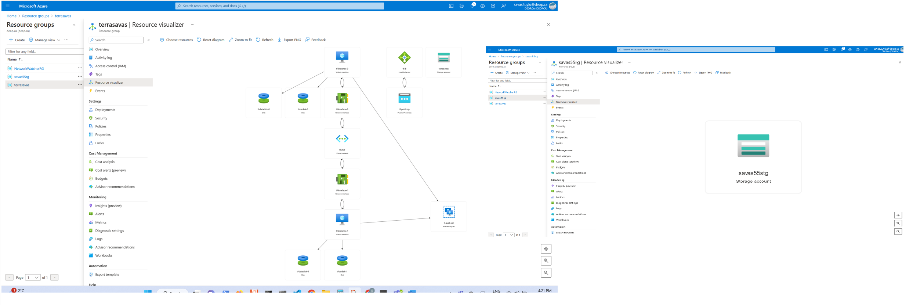


## Task-1: Storing Terraform State File Project in Azure Cloud

In this task, you will deploy your storage with container for the file.

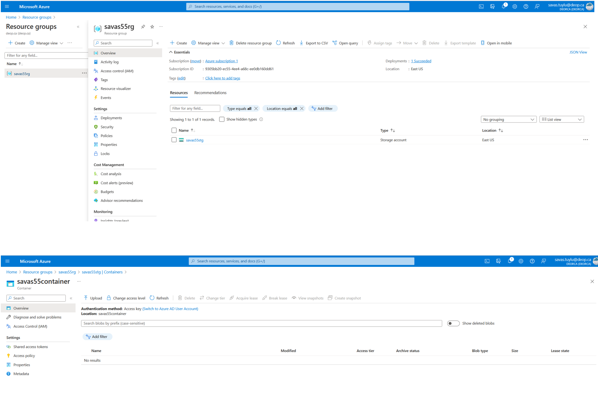

To store tfstate of the project here in VS Code 

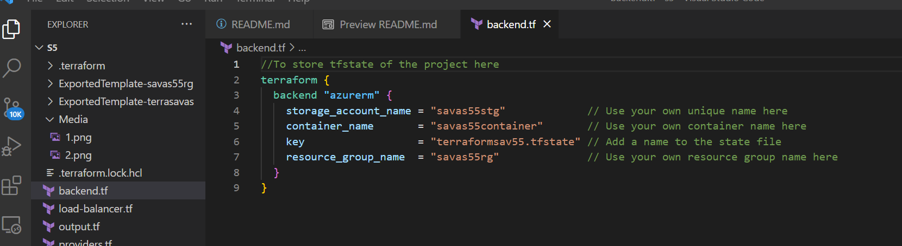

## Task-2: Provision the requested Azure Environment

In this task, you will deploy resources in order.

Resource Groups in Portal
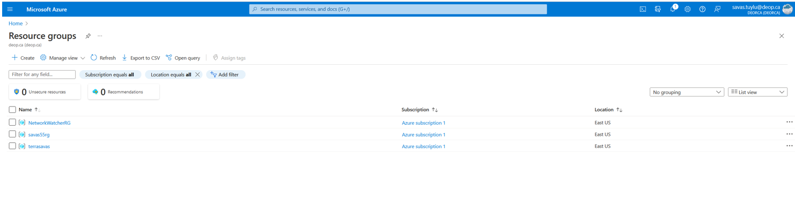


Resource Groups in VS Code
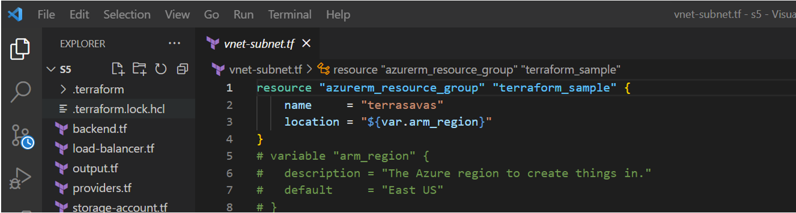

Storage Containers in Portal
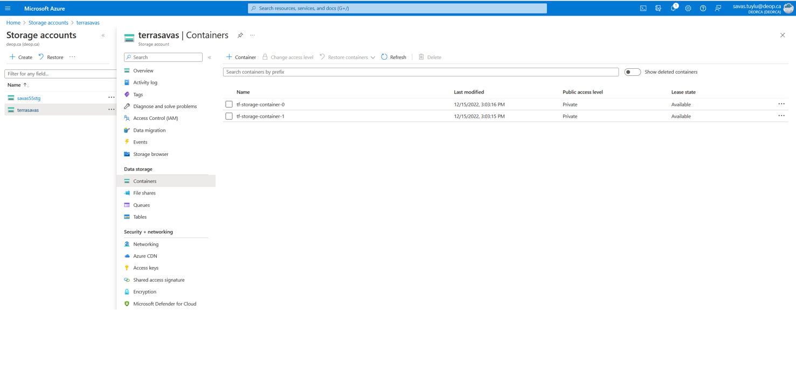

Storage Containers in VS Code
```
//Storage Container for O,1
resource "azurerm_storage_container" "frontend" {
  count                 = var.arm_frontend_instances
  name                  = "tf-storage-container-${count.index}"
  storage_account_name  = azurerm_storage_account.frontend.name
  container_access_type = "private"
}
```

Availability Set in Portal
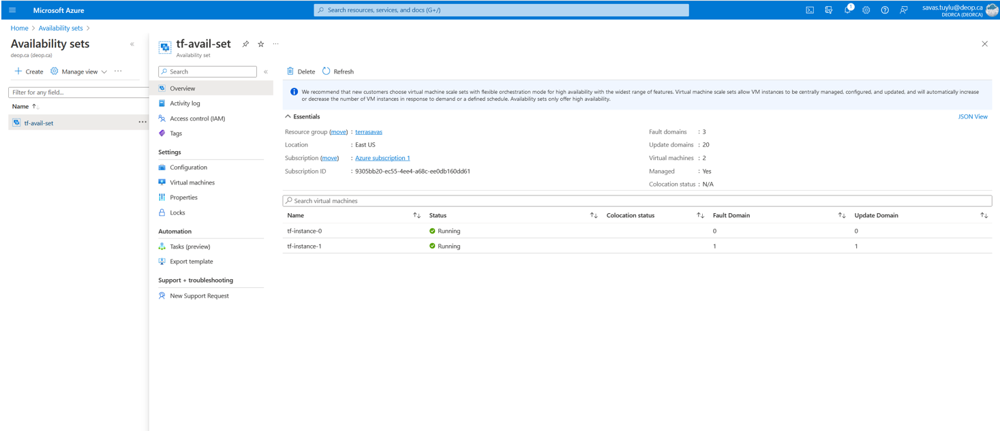

Availability Set in VS Code
```
//Availability Set
resource "azurerm_availability_set" "frontend" {
  name                         = "tf-avail-set"
  location                     = azurerm_resource_group.terraform_sample.location
  resource_group_name          = azurerm_resource_group.terraform_sample.name
  platform_fault_domain_count  = 3
  platform_update_domain_count = 20
  managed                      = true
  tags = {
    environment = "Production"
  }
}
```
Virtual Network/Subnets in Portal
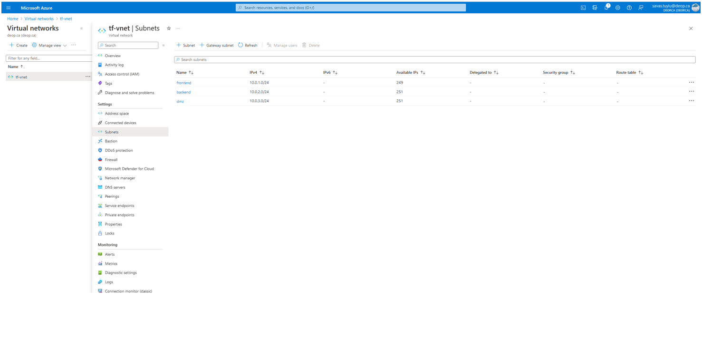

Virtual Network/Subnets in VS Code
```
//Virtual Network
resource "azurerm_virtual_network" "my_vn" {
  name                = "tf-vnet"
  address_space       = ["10.0.0.0/16"]
  location            = "${azurerm_resource_group.terraform_sample.location}"
  resource_group_name = "${azurerm_resource_group.terraform_sample.name}"
}
//Subnet for Frontend
resource "azurerm_subnet" "my_subnet_frontend" {
  name                 = "frontend"
  resource_group_name  = "${azurerm_resource_group.terraform_sample.name}"
  virtual_network_name = "${azurerm_virtual_network.my_vn.name}"
  address_prefixes      = ["10.0.1.0/24"]
}

//To the below output code will draw Frontend ID from above code block for better understanding
# output "frontend_id" {
#   value = "${azurerm_subnet.my_subnet_frontend.id}"

//Subnet for Backend
resource "azurerm_subnet" "my_subnet_backend" {
  name                 = "backend"
  resource_group_name  = "${azurerm_resource_group.terraform_sample.name}"
  virtual_network_name = "${azurerm_virtual_network.my_vn.name}"
  address_prefixes      = ["10.0.2.0/24"]
}

//To the below output code will draw Backend ID from above code block for better understanding
# output "backend_id" {
#   value = "${azurerm_subnet.my_subnet_backend.id}"
# }

//Subnet for DMZ
resource "azurerm_subnet" "my_subnet_dmz" {
  name                 = "dmz"
  resource_group_name  = "${azurerm_resource_group.terraform_sample.name}"
  virtual_network_name = "${azurerm_virtual_network.my_vn.name}"
  address_prefixes      = ["10.0.3.0/24"]
}

//To the below output code will draw DMZ ID from above code block for better understanding
# output "dmz_id" {
#   value = "${azurerm_subnet.my_subnet_dmz.id}"
```

Resources in RG in Portal
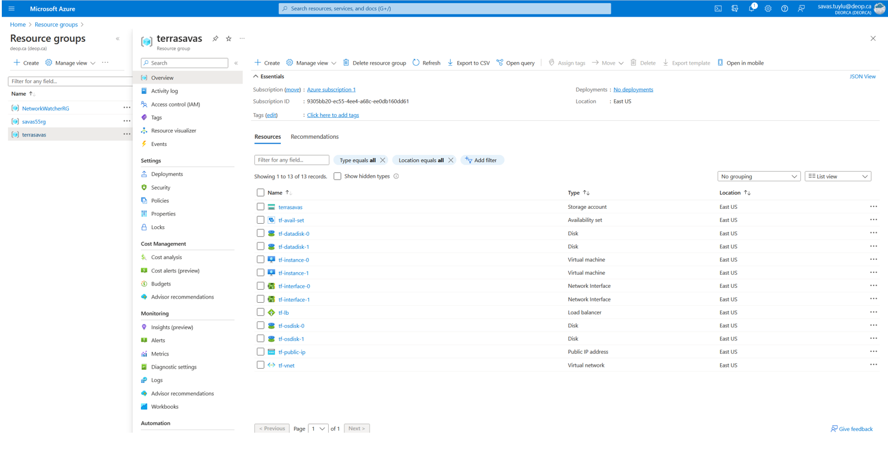

Load Blancer in Portal
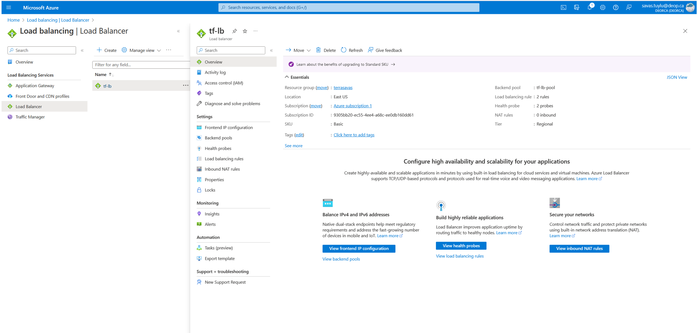

Load Blancer Public IP  in Portal
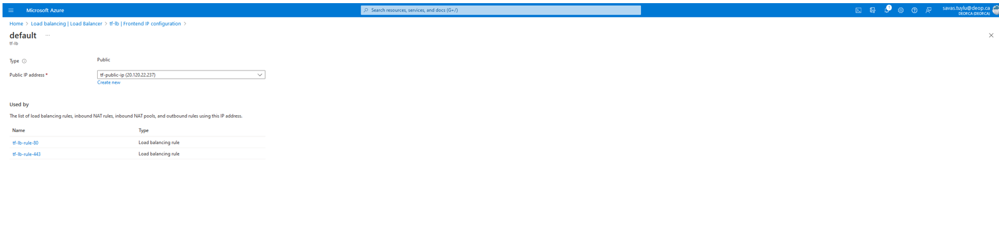

Load Blancer Public ip in VS Code code block
```
//Public ip for Frontend
resource "azurerm_public_ip" "frontend" {
  name                = "tf-public-ip"
  location            = azurerm_resource_group.terraform_sample.location
  resource_group_name = azurerm_resource_group.terraform_sample.name
  allocation_method   = "Static"
}
//To the below output code will draw IP from above code block for better understanding
# output "load_balancer_ip" {
#   value = "${azurerm_public_ip.frontend.ip_address}"

//Load Balancer for Frontend
resource "azurerm_lb" "frontend" {
  name                = "tf-lb"
  location            = azurerm_resource_group.terraform_sample.location
  resource_group_name = azurerm_resource_group.terraform_sample.name
  frontend_ip_configuration {
    name                          = "default"
    public_ip_address_id          = azurerm_public_ip.frontend.id
    private_ip_address_allocation = "dynamic"
  }
}

```

Load Balancer Probe 80 in Portal
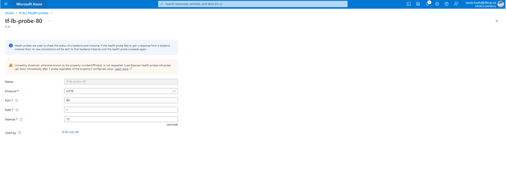

Load Balancer Probe 80 in VS Code
```
//Load Balancer Probe 80
resource "azurerm_lb_probe" "port80" {
  name            = "tf-lb-probe-80"
  loadbalancer_id = azurerm_lb.frontend.id
  protocol        = "Http"
  request_path    = "/"
  port            = 80
}
```

Load Balancer Rule 80 in Portal
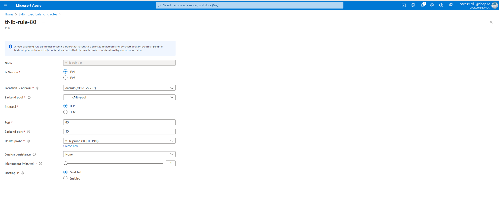

Load Balancer Rule 80 in VS Code
```
//Load Balancer Rule 80
resource "azurerm_lb_rule" "port80" {
  name                           = "tf-lb-rule-80"
  loadbalancer_id                = azurerm_lb.frontend.id
  backend_address_pool_ids       = ["${azurerm_lb_backend_address_pool.frontend.id}"]
  probe_id                       = azurerm_lb_probe.port80.id
  protocol                       = "Tcp"
  frontend_port                  = 80
  backend_port                   = 80
  frontend_ip_configuration_name = "default"
}
```

Load Balancer Probe 443 in Portal
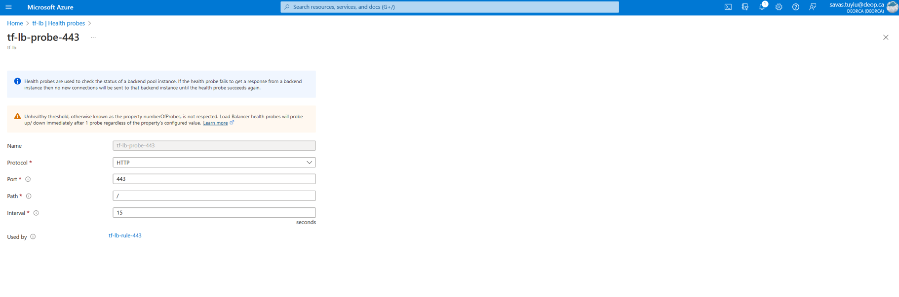

Load Balancer Probe 443 in VS Code
```
//Load Balancer Probe 443
resource "azurerm_lb_probe" "port443" {
  name            = "tf-lb-probe-443"
  loadbalancer_id = azurerm_lb.frontend.id
  protocol        = "Http"
  request_path    = "/"
  port            = 443
}

```

Load Balancer Rule 443 in Portal
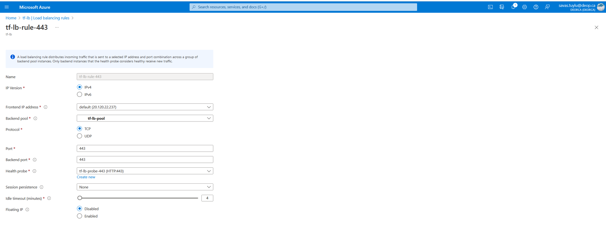

Load Balancer Rule 443 in VS Code
```
//Load Balancer Rule 443
resource "azurerm_lb_rule" "port443" {
  name                           = "tf-lb-rule-443"
  loadbalancer_id                = azurerm_lb.frontend.id
  backend_address_pool_ids       = ["${azurerm_lb_backend_address_pool.frontend.id}"]
  probe_id                       = azurerm_lb_probe.port443.id
  protocol                       = "Tcp"
  frontend_port                  = 443
  backend_port                   = 443
  frontend_ip_configuration_name = "default"
}
```

Load Balancer Backend Address Pool in Portal
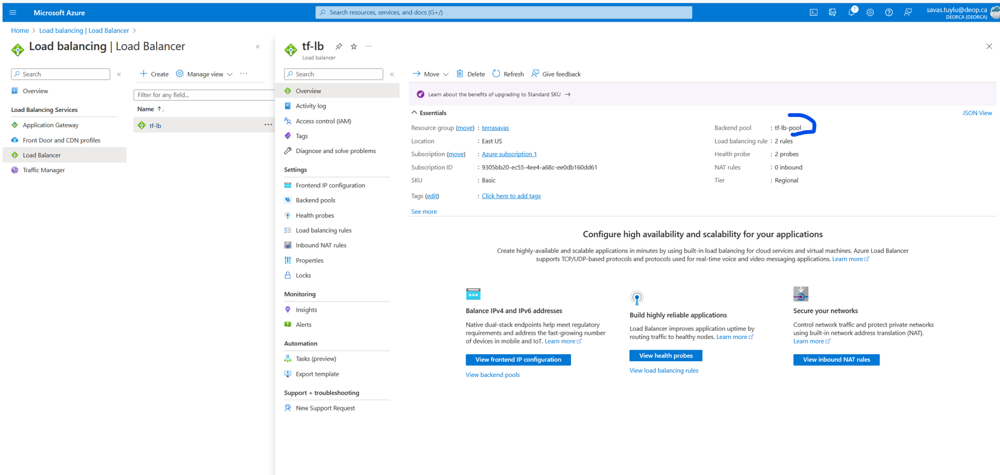

Load Balancer Backend Address Pool in VS Code
```
//Load Balancer Backend Address Pool
resource "azurerm_lb_backend_address_pool" "frontend" {
  name            = "tf-lb-pool"
  loadbalancer_id = azurerm_lb.frontend.id
}
```

Storage Containers for O,1 in Portal
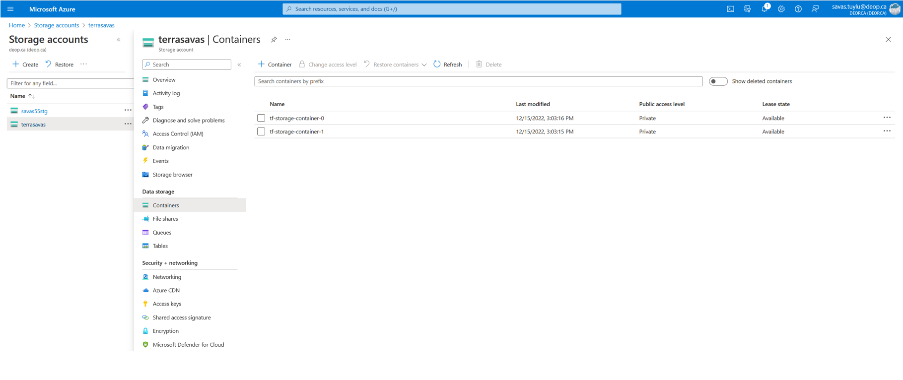

Storage Containers for O,1 in VS Code
```
//Storage Container for O,1
resource "azurerm_storage_container" "frontend" {
  count                 = var.arm_frontend_instances
  name                  = "tf-storage-container-${count.index}"
  storage_account_name  = azurerm_storage_account.frontend.name
  container_access_type = "private"
}
```
Network Interfaces for 0,1 in Portal  
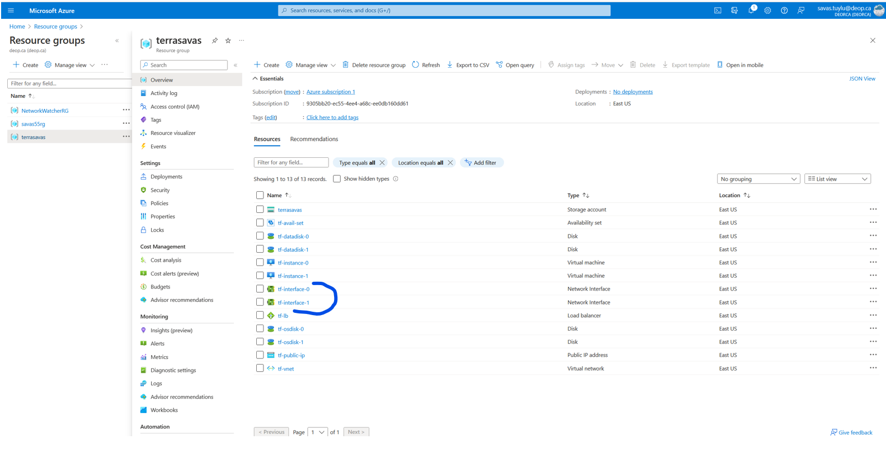

Network Interfaces for 0,1 in VS Code  
```
//Network Interfaces for 0,1 
resource "azurerm_network_interface" "frontend" {
  count               = var.arm_frontend_instances
  name                = "tf-interface-${count.index}"
  location            = azurerm_resource_group.terraform_sample.location
  resource_group_name = azurerm_resource_group.terraform_sample.name
```

IP Configurations for 0,1 in Portal 
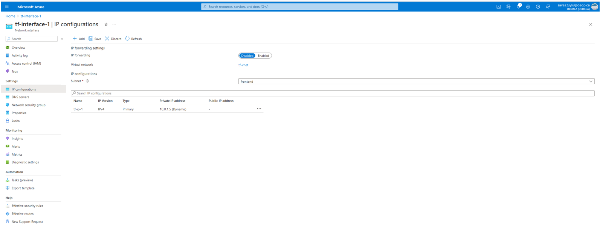

IP Configurations for 0,1 in VS Code
```
//IP Configuration for 0,1
  ip_configuration {
    name                          = "tf-ip-${count.index}"
    subnet_id                     = azurerm_subnet.my_subnet_frontend.id
    private_ip_address_allocation = "Dynamic"
  }
}
```

Virtual Machines for 0,1 in Portal
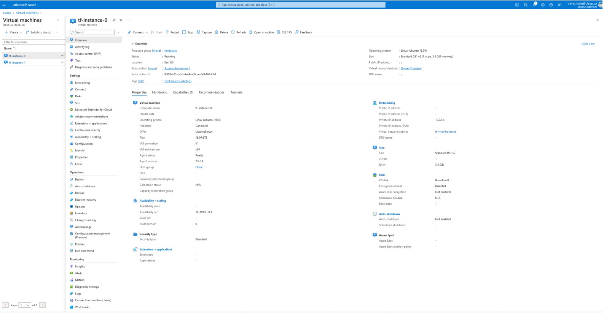


Virtual Machines for 0,1 in VS Code
```
//Virtual Machine for 0,1
resource "azurerm_virtual_machine" "frontend" {
  count                 = var.arm_frontend_instances
  name                  = "tf-instance-${count.index}"
  location              = azurerm_resource_group.terraform_sample.location
  resource_group_name   = azurerm_resource_group.terraform_sample.name
  network_interface_ids = ["${element(azurerm_network_interface.frontend.*.id, count.index)}"]
  vm_size               = "Standard_DS1_v2"
  availability_set_id   = azurerm_availability_set.frontend.id

//The below variable code block for visual understanding of the above code block
  # variable "arm_frontend_instances" {
  #   description = "Number of front instances"
  #   default     = 2
  
//Storage Image Reference
  storage_image_reference {
    publisher = "Canonical"
    offer     = "UbuntuServer"
    sku       = "16.04-LTS"
    version   = "latest"
  }  
```
Storage OS and Data Disks for 0,1 in Portal
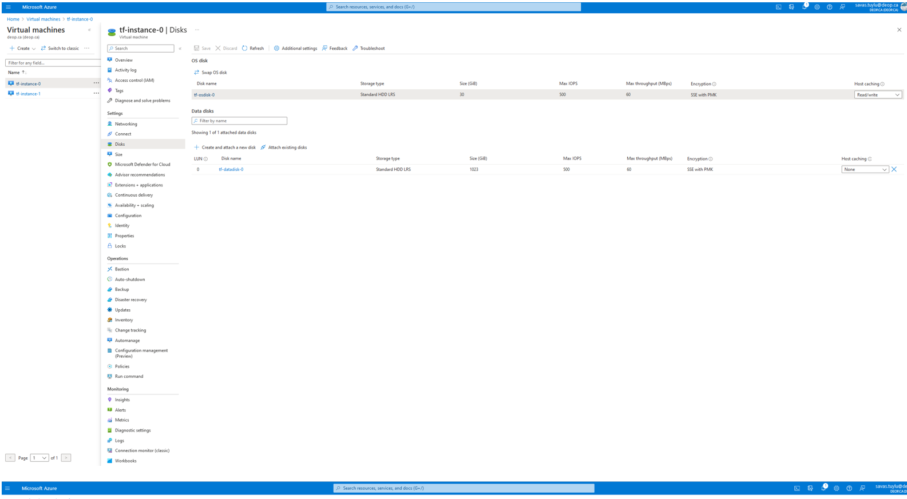

Storage OS and Data Disks for 0,1 in VS Code
```
//Storage OS Disk for 0,1
  storage_os_disk {
    name              = "tf-osdisk-${count.index}"
    caching           = "ReadWrite"
    create_option     = "FromImage"
    managed_disk_type = "Standard_LRS"
  }

  # Optional data disks
//Storage Data Disk for 0,1
  storage_data_disk {
    name              = "tf-datadisk-${count.index}"
    managed_disk_type = "Standard_LRS"
    disk_size_gb      = "1023"
    create_option     = "Empty"
    lun               = 0
  }

 //Delete OS Disk on Termination
  delete_os_disk_on_termination    = true
//Delete Data Disk on Termination
  delete_data_disks_on_termination = true

//OS Profile for 0,1
  os_profile {
    computer_name  = "tf-instance-${count.index}"
    admin_username = "demo"
    admin_password = var.arm_vm_admin_password
  }

//The below variable code block for visual understanding of the above code block
  #   variable "arm_vm_admin_password" {
  #   description = "Passwords for the root user in VMs."
  #   default     = "SUper.123-" # This should be hidden and passed as variable, doing this just for training purpose
  
//OS Profile Linux Config
  os_profile_linux_config {
    disable_password_authentication = false
  }
} 
```

## Task-3: Execution of Outputs.
In this task, you will print outputs.

Output of Subnets ID and lb IP in Portal
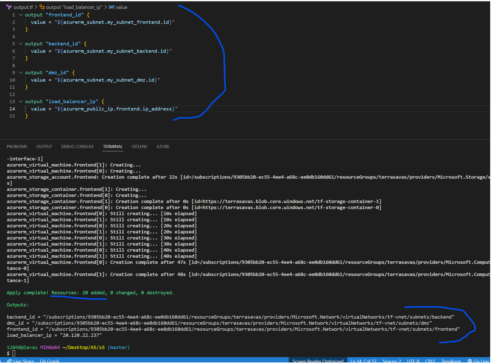

Output of Subnets ID in VS Code
```
// Output of Subnet for Frontend ID
output "frontend_id" {
  value = azurerm_subnet.my_subnet_frontend.id
}
// Output of Subnet for Backend ID
output "backend_id" {
  value = azurerm_subnet.my_subnet_backend.id
}
// Output of Subnet for DMZ ID
output "dmz_id" {
  value = azurerm_subnet.my_subnet_dmz.id
}
// Output of Load Balancer IP
output "load_balancer_ip" {
  value = azurerm_public_ip.frontend.ip_address
}
```
Terraform State File of The Project in Portal
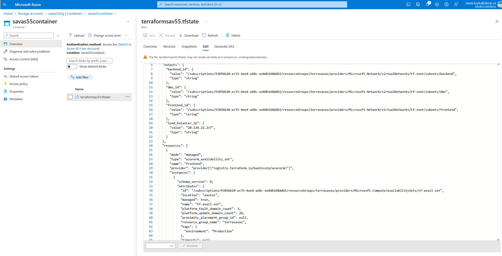

Partial View of Terraform State File in VS Code
```
//Availability Set
resource "azurerm_availability_set" "frontend" {
  name                         = "tf-avail-set"
  location                     = azurerm_resource_group.terraform_sample.location
  resource_group_name          = azurerm_resource_group.terraform_sample.name
  platform_fault_domain_count  = 3
  platform_update_domain_count = 20
  managed                      = true
  tags = {
    environment = "Production"
  }
}
```

 [Savas Tuylu | Linkedin](Linkedin.md) 